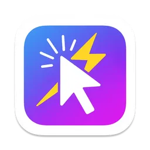

# RapidClicker

A lightweight native **macOS auto-clicker**. Set a click speed, pick a global
hotkey, and RapidClicker will repeatedly click the left mouse button wherever
your cursor is — until you toggle it off with the same hotkey.

<p align="center">
  
</p>

## Features

- **Adjustable click rate** — from 0.001 s to 0.1 s between clicks (≈10–1000 clicks/sec).
- **Global hotkey toggle** — start/stop without switching to the app. Pick a
  modifier combo (`⌘+⇧`, `⌥+⇧`, or `⌘+⌥+⇧`) plus a letter `A`–`Z`.
- **Remembers your settings** — the chosen hotkey is persisted between launches
  (default: `⌘+⇧+A`).
- **Clicks at the cursor** — each click is posted at the pointer's current location.

## Requirements

- macOS 11.5 or later
- Xcode 16 or later (to build from source)

## Building & running

1. Open `RapidClicker.xcodeproj` in Xcode.
2. Select the **RapidClicker** scheme and press **⌘R**.

> **Note on code signing:** the project is set to *Automatic* signing with a
> development team. To build under your own account, change the Team in
> *Signing & Capabilities* (or set it to "None" for a local-only build).

### Accessibility permission (required)

RapidClicker synthesizes mouse events into other apps, which macOS gates behind
the **Accessibility** privacy permission. On first launch the app prompts you to
grant it. If clicks don't seem to register:

1. Open **System Settings → Privacy & Security → Accessibility**.
2. Enable **RapidClicker** (add it with **+** if it isn't listed).
3. Relaunch the app.

> Because it posts system-wide events, the app runs **without the App Sandbox**
> and is therefore not distributable via the Mac App Store. See
> [`RapidClicker.entitlements`](RapidClicker/RapidClicker.entitlements).

## Usage

1. Launch RapidClicker and grant Accessibility permission when prompted.
2. (Optional) Choose a **modifier + key**, then click **Set Shortcut** to change
   the global hotkey.
3. Drag the slider to set your click **interval**.
4. Click **Start** (or press your hotkey) to begin; **Stop** (or the hotkey
   again) to end. The hotkey works even when the window isn't focused.

## Project structure

```
RapidClicker/
├── AppDelegate.swift      App lifecycle, global hotkey, Accessibility prompt
├── ViewController.swift   The settings window (hotkey, interval, start/stop)
├── AutoClicker.swift      Timer that posts the synthetic mouse clicks
├── KeyCodes.swift         Letter↔key-code map, modifier combos, FourCharCode
├── ClickSettings.swift    Shared interval setting + notification names
├── Base.lproj/            Main.storyboard (UI layout)
├── Assets.xcassets/       App icon & accent color
├── Info.plist             Bundle configuration
└── RapidClicker.entitlements
RapidClickerTests/         Unit tests (Swift Testing)
RapidClickerUITests/       UI test stubs (XCTest)
```

### How it works

- **Hotkey** — registered through the Carbon `RegisterEventHotKey` API and tagged
  with a four-char signature (`"Rcik"`). A single Carbon event handler watches for
  it and calls `AppDelegate.toggleClick()`.
- **Clicking** — `AutoClicker` schedules a repeating `Timer`; each tick posts a
  `.leftMouseDown` + `.leftMouseUp` pair via `CGEvent` at the cursor's location.
- **State** — `ClickSettings.shared` holds the interval and broadcasts changes
  over `NotificationCenter`, which keeps the UI and engine in sync.

## Tests

Run the unit tests from Xcode with **⌘U**. They cover the key-code map, the
modifier combinations, and the `FourCharCode` packing helper.

## License

No license has been specified yet. All rights reserved by the author unless a
`LICENSE` file is added.

---

Built by **Emil Wirén Jensen (EWJ)**.
